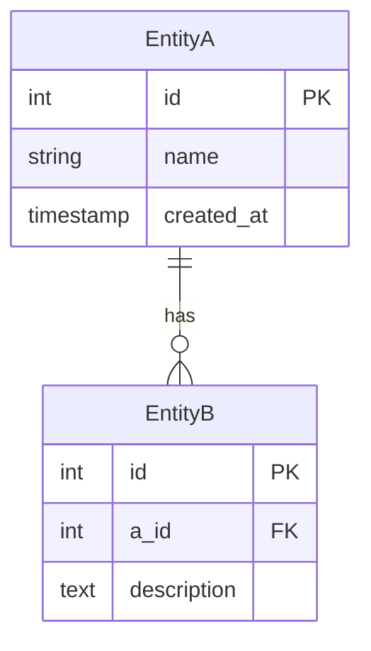

# D-19 — Database Design (ER Diagram)

## 1. Overview
- **Overview**: (Describe the scope and purpose of this database design)

## 2. ER Diagram

> [!NOTE]
> Describe the relationships between tables with an ER diagram (using Mermaid).

## 3. Table Definitions

---
### 3.1. Table Name
- **Logical name**:
- **Physical name**:
- **Overview**:

| Logical name | Physical name | Type | Constraints | Description |
|---|---|---|---|---|
| ID | id | INTEGER | PK, NOT NULL, AUTO_INCREMENT | |
| | | | | |

---

## 4. Index Definitions

> [!NOTE]
> Indexes are PROPOSALS (B2-4) — suggested from access patterns, not imposed. Mark a proposed-but-unconfirmed index in the Status column.

| Table (physical) | Index name | Columns | UNIQUE | Status (proposed / confirmed) |
|---|---|---|---|---|
| | | | | |

---

## 5. Grounding-to-code log

> [!NOTE]
> B2-7 — ground the design against the REAL schema/models/migrations. Log EVERY divergence. Greenfield: a single `N/A — greenfield` row.

| Entity / model | Ground-truth source (code ref / migration) | Divergence | Resolution (follows code / planned / out-of-scope) |
|---|---|---|---|
| | | | |

---

**Revision History**

| Date | Version | Changes | Author |
|---|---|---|---|
| yyyy-mm-dd | 1.0 | Initial creation | |
