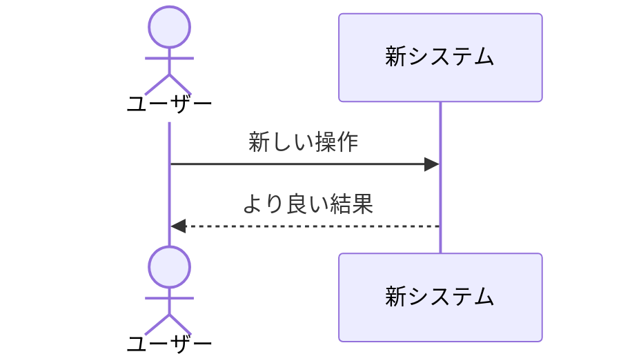

# D-01 企画書

## 1. プロジェクト概要
- **プロジェクト名**: 
- **背景・課題**:
- **目的とゴール**:

## 2. 体制
| 役割 | 担当者 | 連絡先 |
|---|---|---|
| | | |

## 3. スケジュール
| フェーズ | 開始日 | 終了日 | 主な成果物 |
|---|---|---|---|
| | | | |

## 4. コスト
- **人件費**: 
- **その他経費**: 
- **合計**: 

## 5. 業務フロー（AS-IS / TO-BE）
### AS-IS（現状）

### TO-BE（導入後）

## 6. 用語集
| 用語 | 説明 |
|---|---|
| | |

## 7. コミュニケーション計画
- **定例会議**: 
- **チャットツール**: 
- **情報共有**: 

## 8. 参考資料
- 

---

**改訂履歴**

| 日付 | バージョン | 改訂内容 | 担当者 |
|---|---|---|---|
| yyyy-mm-dd | 1.0 | 初版作成 | |
