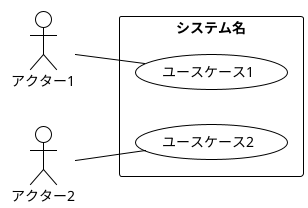

# D-05 ユースケース図

## (システム名)のユースケース図

```plantuml
@startuml
!theme plain
left to right direction

actor "アクター1" as A1
actor "アクター2" as A2

rectangle "(システム名)" {
  usecase "ユースケース1" as UC1
  usecase "ユースケース2" as UC2
}

A1 -- UC1
A2 -- UC2
@enduml
```

---

**改訂履歴**

| 日付 | バージョン | 改訂内容 | 担当者 |
|---|---|---|---|
| yyyy-mm-dd | 1.0 | 初版作成 | |
