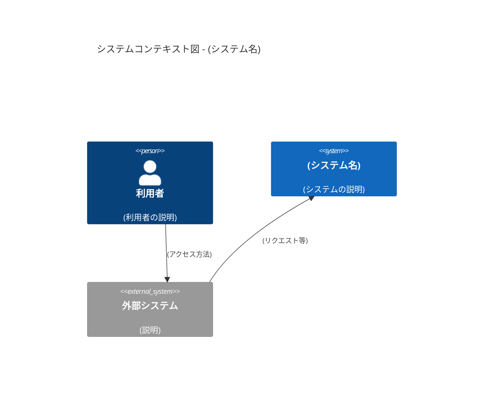
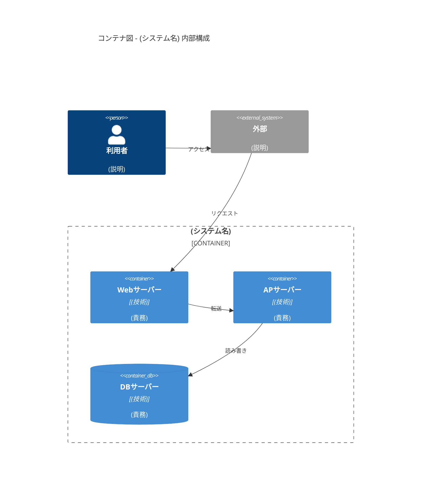
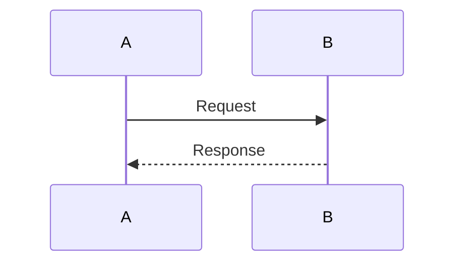

# D-09 アーキテクチャ設計書

## 1. 概要
- 

## 2. アーキテクチャ目標と制約
- **目標**:
- **制約**:

## 3. 論理アーキテクチャ
- （3層アーキテクチャなどを採用する場合の概要を1行で記述）

### 3.1. システムコンテキスト図（C4Context）
利用者と当該システム、および外部との関係を表す。

### 3.2. コンテナ図（C4Container）
システム内部の主要なコンテナ（Web/AP/DB など）とその関係を表す。

### 3.3. 各層の責務
- **プレゼンテーション層**: （記述）
- **アプリケーション層**: （記述）
- **データ層**: （記述）

## 4. 物理アーキテクチャ
- 詳細は **[D-10 システム構成図](./D-10_システム構成図_template.md)** を参照。

## 5. 技術スタック
- 詳細は **[README（技術スタック）](../README.md)** を参照。

## 6. データフロー

## 7. セキュリティ設計
- 
- 

## 8. アーキテクチャ決定録 (ADR)
- **決定事項**: 
- **理由**: 
- **検討した代替案**: 

---

**改訂履歴**

| 日付 | バージョン | 改訂内容 | 担当者 |
|---|---|---|---|
| yyyy-mm-dd | 1.0 | 初版作成 | |
