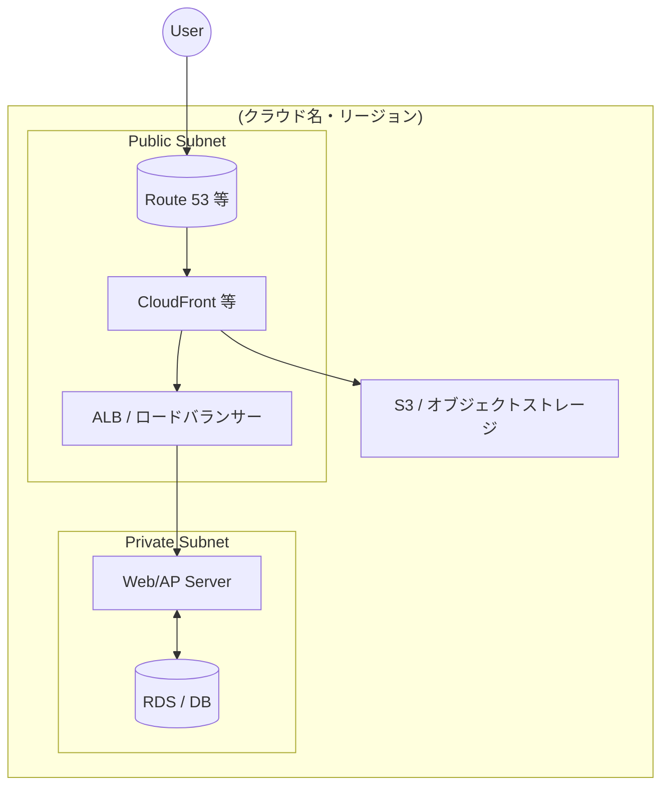

# D-10 システム構成図

## 1. 概要
- （対象システムのインフラ構成の概要を1〜2文で記述）

## 2. システム構成図

> [!NOTE]
> 図は **Mermaid** の flowchart で記述してください。draw.io は更新が面倒なため非推奨です。詳細は [D-10 システム構成図 ガイドライン](./../guidelines/D-10_システム構成図_guideline.md) を参照してください。

## 3. 補足説明
- **ネットワーク**:
  - （リージョン、サブネットの役割、アクセス制御の方針など）
- **可用性**:
  - （冗長構成、Auto Scaling、フェイルオーバーなど）
- **静的コンテンツ**（該当する場合）:
  - （CDN・オブジェクトストレージの利用方針など）

---

**改訂履歴**

| 日付 | バージョン | 改訂内容 | 担当者 |
|---|---|---|---|
| yyyy-mm-dd | 1.0 | 初版作成 | |
