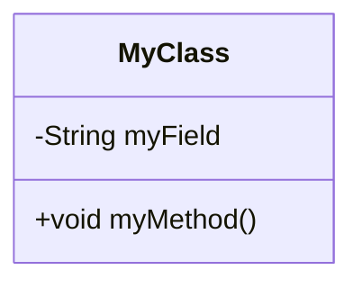

# D-16 詳細設計書

## 1. はじめに
このドキュメントは、(対象コンポーネント/モジュール名) の詳細設計を記述します。
[D-08 基本設計書](./D-08_基本設計書_template.md) をもとに、実装可能なレベルまで設計を具体化することを目的とします。

## 2. 設計概要
(対象コンポーネント/モジュールの役割や責務、他のモジュールとの関連などを記述します)

## 3. クラス/モジュール構成
(クラス図やコンポーネント図をMermaidなどで記述します。クラス図は本ドキュメント（D-16 詳細設計書）内で記述するか、必要に応じて別セクションで参照してください)

## 4. 機能詳細設計

---
### 4.1. (機能名)

- **機能ID**:
- **機能概要**:
- **入力**:
    | 名称 | 型 | 説明 |
    |---|---|---|
    | | | |
- **出力**:
    | 名称 | 型 | 説明 |
    |---|---|---|
    | | | |
- **処理フロー**:
    1.
    2.
    3.
    (シーケンス図をMermaidなどで記述することも可能です。詳細は [D-17 シーケンス図](./D-17_シーケンス図_template.md) を参照)
- **特記事項**:
    (アルゴリズム、使用するライブラリ、例外処理など特筆すべき点を記述します)
---

## 5. データ構造
(本設計で利用する主要なデータ構造、DTOなどを定義します)

| 名称 | 型 | 説明 |
|---|---|---|
| | | |

---

**改訂履歴**

| 日付 | バージョン | 改訂内容 | 担当者 |
|---|---|---|---|
| yyyy-mm-dd | 1.0 | 初版作成 | |
