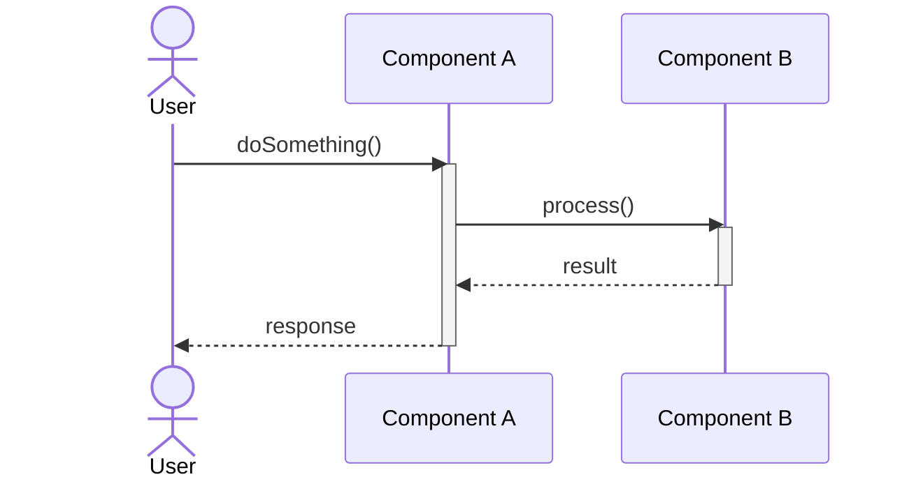

# D-17 シーケンス図

## 1. 概要
- **ID**: 
- **名称**: 
- **概要**: (シーケンスの目的や登場するオブジェクトの概要を記述します)

## 2. シーケンス図

> [!NOTE]
> 処理のフローをMermaidのシーケンス図で記述します。

## 3. 処理内容の詳細
(シーケンス図だけでは伝わらない補足情報や、各ステップのより詳細な処理内容を記述します)

| No. | ステップ | 説明 |
|---|---|---|
| 1 | User -> Component A | |
| 2 | Component A -> Component B | |
| 3 | Component B -> Component A | |
| 4 | Component A -> User | |

---

**改訂履歴**

| 日付 | バージョン | 改訂内容 | 担当者 |
|---|---|---|---|
| yyyy-mm-dd | 1.0 | 初版作成 | |
