# D-23 バッチスケジュール表

## 1. はじめに
- **概要**: (このドキュメントの目的や対象となるバッチ処理の概要を記述します)

## 2. バッチ処理一覧

| バッチID | バッチ名 | 概要 | 実行方式 | 実行サイクル | 実行時刻 | タイムアウト | 担当 | 備考 |
|---|---|---|---|---|---|---|---|---|
| | | | | | | | | |
| | | | | | | | | |

## 3. 実行スケジュールと依存関係
(バッチ処理の実行タイムラインと、処理間の依存関係をMermaidのガントチャートで示します)

```mermaid
gantt
    title バッチ実行スケジュール
    dateFormat  HH:mm
    axisFormat %H:%M
    section 夜間バッチ
    BATCH-001           :01:00, 2h
    BATCH-002           :after BATCH-001, 30m
    section 月次バッチ
    BATCH-003           :04:00, 1h
```

## 4. バッチ処理詳細

---
### 4.1. (バッチ名)
- **バッチID**: 
- **概要**: 
- **起動条件**: 
- **入力**: 
- **処理内容**: 
  1. 
  2. 
- **出力**: 
- **正常終了条件**: 
- **異常終了時の挙動**: (リトライの有無、通知先など)
---

**改訂履歴**

| 日付 | バージョン | 改訂内容 | 担当者 |
|---|---|---|---|
| yyyy-mm-dd | 1.0 | 初版作成 | |
