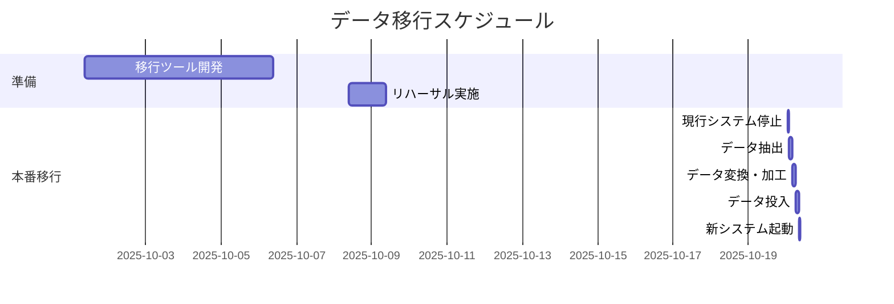

# D-25 移行設計書

## 1. はじめに
- **目的**: 
- **移行対象システム**:
  - **移行元**: 
  - **移行先**: 
- **移行期間**: yyyy-mm-dd hh:mm ~ yyyy-mm-dd hh:mm

## 2. 移行方針
- **基本方針**: (一括移行 or 段階的移行, オンライン or オフライン)
- **移行対象データ**: 
- **対象外データ**: 

## 3. 移行体制
| 役割 | 担当者 |
|---|---|
| | |

## 4. 移行スケジュール (詳細)

## 5. 移行手順
- **事前準備**:
  1. 
- **移行当日**:
  1. 
- **事後作業**:
  1. 

## 6. データマッピング
| No. | 移行元テーブル | 移行元カラム | 移行先テーブル | 移行先カラム | 変換・加工ルール |
|---|---|---|---|---|---|
| | | | | | |

## 7. 移行後の検証方法
- **件数検証**: 移行元と移行先で件数が一致することを確認するSQLなど。
- **内容検証**: 特定のデータを抽出し、正しく移行されていることを目視で確認する手順など。

## 8. 切り戻し計画
- **切り戻し判断基準**: (例: 検証作業で致命的な不整合が発覚した場合)
- **切り戻し手順**:
  1. 

---

**改訂履歴**

| 日付 | バージョン | 改訂内容 | 担当者 |
|---|---|---|---|
| yyyy-mm-dd | 1.0 | 初版作成 | |
