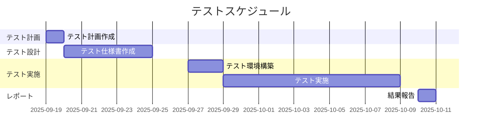

# D-26 テスト計画書

## 1. はじめに
- **目的**: 
- **対象範囲**: 
- **テストのゴール**: (例: XX機能が仕様通り動作することを確認し、品質を保証する)

## 2. テスト全体方針
- **テストレベル**: (単体テスト、結合テスト、システムテストなど)
- **テスト観点**: (機能テスト、性能テスト、セキュリティテストなど)
- **自動化方針**: (どこまでを自動化し、どこからを手動で行うか)

## 3. テスト体制
| 役割 | 担当者 |
|---|---|
| テストマネージャー | |
| テスト設計者 | |
| テスト実施者 | |

## 4. スケジュール

## 5. テスト環境
- **ハードウェア**: 
- **ソフトウェア/OS**: 
- **テストツール**: (例: Selenium, JUnit, Postman)
- **テストデータ**: 

## 6. 開始/終了基準
- **開始基準**: (テストを開始するための条件)
  - (例) テスト仕様書のレビューが完了していること。
- **終了基準**: (テストを終了するための条件)
  - (例) クリティカルな不具合が0件であること。
  - (例) テストケース消化率が95%以上であること。

## 7. リスクと対策
| リスク | 発生可能性 | 影響度 | 対策 |
|---|---|---|---|
| | 高/中/低 | 大/中/小 | |
| | 高/中/低 | 大/中/小 | |

---

**改訂履歴**

| 日付 | バージョン | 改訂内容 | 担当者 |
|---|---|---|---|
| yyyy-mm-dd | 1.0 | 初版作成 | |
